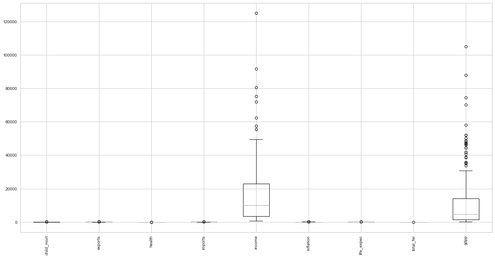
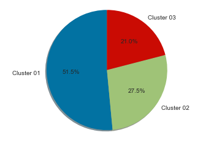
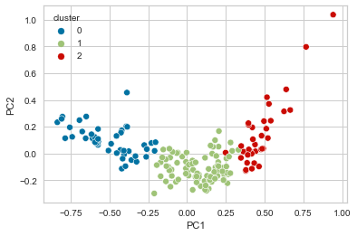
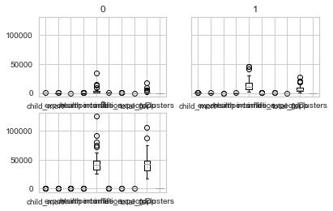
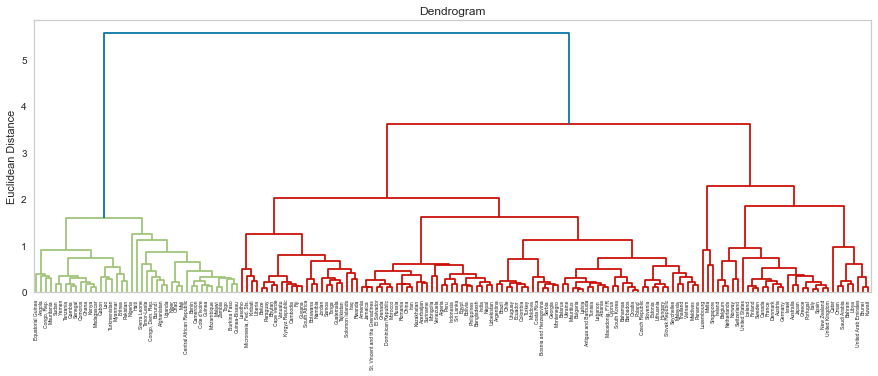
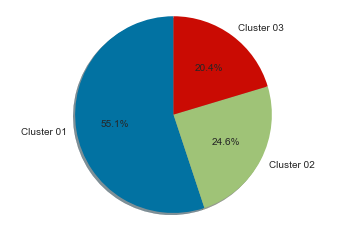
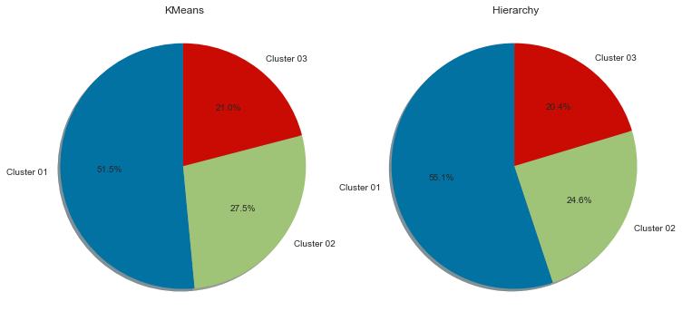
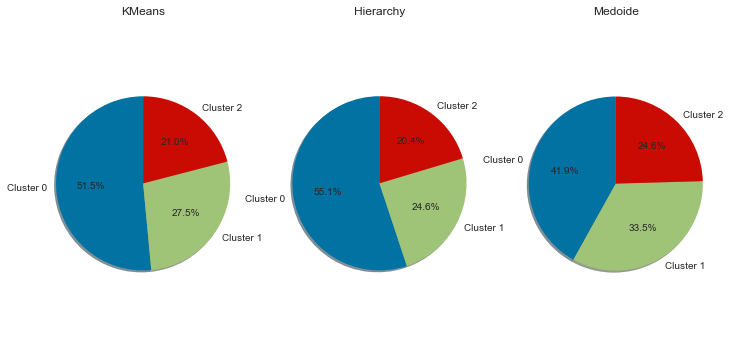

#  <span style="color:purple">Algoritmos Não-Supervisionados para clusterização [22E4_2]</span>

**Erik Tavares dos Anjos** </br>
Atualizado: 07/11/2022 </br>
Git: https://github.com/eriktavares/clustering </br>


##  <span style="color:purple">Infraestrutura</span>
Para as questões a seguir, você deverá executar códigos em um notebook Jupyter, rodando em ambiente local, certifique-se que:

Você está rodando em Python 3.9+
Você está usando um ambiente virtual: Virtualenv ou Anaconda
Todas as bibliotecas usadas nesse exercícios estão instaladas em um ambiente virtual específico
Gere um arquivo de requerimentos (requirements.txt) com os pacotes necessários. É necessário se certificar que a versão do pacote está disponibilizada.
Tire um printscreen do ambiente que será usado rodando em sua máquina.
Disponibilize os códigos gerados, assim como os artefatos acessórios (requirements.txt) e instruções em um repositório GIT público. (se isso não for feito, o diretório com esses arquivos deverá ser enviado compactado no moodle).

**1. Baixe os dados disponibilizados na plataforma Kaggle sobre dados sócio-econômicos e de saúde que determinam o índice de desenvolvimento de um país. Esses dados estão disponibilizados através do link: https://www.kaggle.com/datasets/rohan0301/unsupervised-learning-on-country-data**

Base de dados na pasta ../Data/raw/Country-data.csv e data-dictionary.csv

**2. Quantos países existem no dataset?**


```python
import pandas as pd
df=pd.read_csv('../Data/raw/Country-data.csv')
df['country'].describe()
```


    count             167
    unique            167
    top       Afghanistan
    freq                1
    Name: country, dtype: object


Existem 167 países no dataset, conforme o describre. O count conta que existem 167 linhas e o unique mostra que existem 167 paises, sendo 1 diferente para cada linha.

**3.Mostre através de gráficos a faixa dinâmica das variáveis que serão usadas nas tarefas de clusterização. Analise os resultados mostrados. O que deve ser feito com os dados antes da etapa de clusterização?**

Dimensões 167 Linhas e 10 Colunas


```python
df.shape
```


    (167, 10)


```python
df.describe().T
```


<div>
<style scoped>
    .dataframe tbody tr th:only-of-type {
        vertical-align: middle;
    }

    .dataframe tbody tr th {
        vertical-align: top;
    }

    .dataframe thead th {
        text-align: right;
    }
</style>
<table border="1" class="dataframe">
  <thead>
    <tr style="text-align: right;">
      <th></th>
      <th>count</th>
      <th>mean</th>
      <th>std</th>
      <th>min</th>
      <th>25%</th>
      <th>50%</th>
      <th>75%</th>
      <th>max</th>
    </tr>
  </thead>
  <tbody>
    <tr>
      <th>child_mort</th>
      <td>167.0</td>
      <td>38.270060</td>
      <td>40.328931</td>
      <td>2.6000</td>
      <td>8.250</td>
      <td>19.30</td>
      <td>62.10</td>
      <td>208.00</td>
    </tr>
    <tr>
      <th>exports</th>
      <td>167.0</td>
      <td>41.108976</td>
      <td>27.412010</td>
      <td>0.1090</td>
      <td>23.800</td>
      <td>35.00</td>
      <td>51.35</td>
      <td>200.00</td>
    </tr>
    <tr>
      <th>health</th>
      <td>167.0</td>
      <td>6.815689</td>
      <td>2.746837</td>
      <td>1.8100</td>
      <td>4.920</td>
      <td>6.32</td>
      <td>8.60</td>
      <td>17.90</td>
    </tr>
    <tr>
      <th>imports</th>
      <td>167.0</td>
      <td>46.890215</td>
      <td>24.209589</td>
      <td>0.0659</td>
      <td>30.200</td>
      <td>43.30</td>
      <td>58.75</td>
      <td>174.00</td>
    </tr>
    <tr>
      <th>income</th>
      <td>167.0</td>
      <td>17144.688623</td>
      <td>19278.067698</td>
      <td>609.0000</td>
      <td>3355.000</td>
      <td>9960.00</td>
      <td>22800.00</td>
      <td>125000.00</td>
    </tr>
    <tr>
      <th>inflation</th>
      <td>167.0</td>
      <td>7.781832</td>
      <td>10.570704</td>
      <td>-4.2100</td>
      <td>1.810</td>
      <td>5.39</td>
      <td>10.75</td>
      <td>104.00</td>
    </tr>
    <tr>
      <th>life_expec</th>
      <td>167.0</td>
      <td>70.555689</td>
      <td>8.893172</td>
      <td>32.1000</td>
      <td>65.300</td>
      <td>73.10</td>
      <td>76.80</td>
      <td>82.80</td>
    </tr>
    <tr>
      <th>total_fer</th>
      <td>167.0</td>
      <td>2.947964</td>
      <td>1.513848</td>
      <td>1.1500</td>
      <td>1.795</td>
      <td>2.41</td>
      <td>3.88</td>
      <td>7.49</td>
    </tr>
    <tr>
      <th>gdpp</th>
      <td>167.0</td>
      <td>12964.155689</td>
      <td>18328.704809</td>
      <td>231.0000</td>
      <td>1330.000</td>
      <td>4660.00</td>
      <td>14050.00</td>
      <td>105000.00</td>
    </tr>
  </tbody>
</table>
</div>


```python
df_index=df.set_index('country', inplace=True)
df.index.names = [None]
df
```


<div>
<style scoped>
    .dataframe tbody tr th:only-of-type {
        vertical-align: middle;
    }

    .dataframe tbody tr th {
        vertical-align: top;
    }

    .dataframe thead th {
        text-align: right;
    }
</style>
<table border="1" class="dataframe">
  <thead>
    <tr style="text-align: right;">
      <th></th>
      <th>child_mort</th>
      <th>exports</th>
      <th>health</th>
      <th>imports</th>
      <th>income</th>
      <th>inflation</th>
      <th>life_expec</th>
      <th>total_fer</th>
      <th>gdpp</th>
    </tr>
  </thead>
  <tbody>
    <tr>
      <th>Afghanistan</th>
      <td>90.2</td>
      <td>10.0</td>
      <td>7.58</td>
      <td>44.9</td>
      <td>1610</td>
      <td>9.44</td>
      <td>56.2</td>
      <td>5.82</td>
      <td>553</td>
    </tr>
    <tr>
      <th>Albania</th>
      <td>16.6</td>
      <td>28.0</td>
      <td>6.55</td>
      <td>48.6</td>
      <td>9930</td>
      <td>4.49</td>
      <td>76.3</td>
      <td>1.65</td>
      <td>4090</td>
    </tr>
    <tr>
      <th>Algeria</th>
      <td>27.3</td>
      <td>38.4</td>
      <td>4.17</td>
      <td>31.4</td>
      <td>12900</td>
      <td>16.10</td>
      <td>76.5</td>
      <td>2.89</td>
      <td>4460</td>
    </tr>
    <tr>
      <th>Angola</th>
      <td>119.0</td>
      <td>62.3</td>
      <td>2.85</td>
      <td>42.9</td>
      <td>5900</td>
      <td>22.40</td>
      <td>60.1</td>
      <td>6.16</td>
      <td>3530</td>
    </tr>
    <tr>
      <th>Antigua and Barbuda</th>
      <td>10.3</td>
      <td>45.5</td>
      <td>6.03</td>
      <td>58.9</td>
      <td>19100</td>
      <td>1.44</td>
      <td>76.8</td>
      <td>2.13</td>
      <td>12200</td>
    </tr>
    <tr>
      <th>...</th>
      <td>...</td>
      <td>...</td>
      <td>...</td>
      <td>...</td>
      <td>...</td>
      <td>...</td>
      <td>...</td>
      <td>...</td>
      <td>...</td>
    </tr>
    <tr>
      <th>Vanuatu</th>
      <td>29.2</td>
      <td>46.6</td>
      <td>5.25</td>
      <td>52.7</td>
      <td>2950</td>
      <td>2.62</td>
      <td>63.0</td>
      <td>3.50</td>
      <td>2970</td>
    </tr>
    <tr>
      <th>Venezuela</th>
      <td>17.1</td>
      <td>28.5</td>
      <td>4.91</td>
      <td>17.6</td>
      <td>16500</td>
      <td>45.90</td>
      <td>75.4</td>
      <td>2.47</td>
      <td>13500</td>
    </tr>
    <tr>
      <th>Vietnam</th>
      <td>23.3</td>
      <td>72.0</td>
      <td>6.84</td>
      <td>80.2</td>
      <td>4490</td>
      <td>12.10</td>
      <td>73.1</td>
      <td>1.95</td>
      <td>1310</td>
    </tr>
    <tr>
      <th>Yemen</th>
      <td>56.3</td>
      <td>30.0</td>
      <td>5.18</td>
      <td>34.4</td>
      <td>4480</td>
      <td>23.60</td>
      <td>67.5</td>
      <td>4.67</td>
      <td>1310</td>
    </tr>
    <tr>
      <th>Zambia</th>
      <td>83.1</td>
      <td>37.0</td>
      <td>5.89</td>
      <td>30.9</td>
      <td>3280</td>
      <td>14.00</td>
      <td>52.0</td>
      <td>5.40</td>
      <td>1460</td>
    </tr>
  </tbody>
</table>
<p>167 rows × 9 columns</p>
</div>


```python
import matplotlib.pyplot as plt
import seaborn as sns
corr = df.corr()
f, ax = plt.subplots(figsize=(15, 15))
sns.heatmap(corr, square=True, linewidths=.5, annot=True);
```


    

    


**4.Realize o pré-processamento adequado dos dados**

**4.1 Dados Nulos**

Os dataset não possui dados nulos conforme a visualização abaixo


```python
df.isna().sum()
```


    child_mort    0
    exports       0
    health        0
    imports       0
    income        0
    inflation     0
    life_expec    0
    total_fer     0
    gdpp          0
    dtype: int64


**4.2 - Outliears**

Em estatística descritiva, diagrama de caixa, diagrama de extremos e quartis, boxplot ou box plot é uma ferramenta gráfica para representar a variação de dados observados de uma variável numérica por meio de quartis (ver figura 1, onde o eixo horizontal representa a variável). O box plot tem uma reta (whisker ou fio de bigode) que estende–se verticalmente ou horizontalmente a partir da caixa, indicando a variabilidade fora do quartil superior e do quartil inferior.[1] Os valores atípicos ou outliers (valores discrepantes) podem ser plotados como pontos individuais [https://pt.wikipedia.org/wiki/Diagrama_de_caixa]


```python
# Import libraries
import matplotlib.pyplot as plt
import numpy as np
 
#df_features=df.drop()
 
fig = plt.figure(figsize =(20, 10))
# Creating plot
df.boxplot()
plt.xticks(rotation = 90)
# show plot
plt.show()
```


    

    


```python
df[df['income']>50000].sort_values('income', ascending=False)
```


<div>
<style scoped>
    .dataframe tbody tr th:only-of-type {
        vertical-align: middle;
    }

    .dataframe tbody tr th {
        vertical-align: top;
    }

    .dataframe thead th {
        text-align: right;
    }
</style>
<table border="1" class="dataframe">
  <thead>
    <tr style="text-align: right;">
      <th></th>
      <th>child_mort</th>
      <th>exports</th>
      <th>health</th>
      <th>imports</th>
      <th>income</th>
      <th>inflation</th>
      <th>life_expec</th>
      <th>total_fer</th>
      <th>gdpp</th>
    </tr>
  </thead>
  <tbody>
    <tr>
      <th>Qatar</th>
      <td>9.0</td>
      <td>62.3</td>
      <td>1.81</td>
      <td>23.8</td>
      <td>125000</td>
      <td>6.980</td>
      <td>79.5</td>
      <td>2.07</td>
      <td>70300</td>
    </tr>
    <tr>
      <th>Luxembourg</th>
      <td>2.8</td>
      <td>175.0</td>
      <td>7.77</td>
      <td>142.0</td>
      <td>91700</td>
      <td>3.620</td>
      <td>81.3</td>
      <td>1.63</td>
      <td>105000</td>
    </tr>
    <tr>
      <th>Brunei</th>
      <td>10.5</td>
      <td>67.4</td>
      <td>2.84</td>
      <td>28.0</td>
      <td>80600</td>
      <td>16.700</td>
      <td>77.1</td>
      <td>1.84</td>
      <td>35300</td>
    </tr>
    <tr>
      <th>Kuwait</th>
      <td>10.8</td>
      <td>66.7</td>
      <td>2.63</td>
      <td>30.4</td>
      <td>75200</td>
      <td>11.200</td>
      <td>78.2</td>
      <td>2.21</td>
      <td>38500</td>
    </tr>
    <tr>
      <th>Singapore</th>
      <td>2.8</td>
      <td>200.0</td>
      <td>3.96</td>
      <td>174.0</td>
      <td>72100</td>
      <td>-0.046</td>
      <td>82.7</td>
      <td>1.15</td>
      <td>46600</td>
    </tr>
    <tr>
      <th>Norway</th>
      <td>3.2</td>
      <td>39.7</td>
      <td>9.48</td>
      <td>28.5</td>
      <td>62300</td>
      <td>5.950</td>
      <td>81.0</td>
      <td>1.95</td>
      <td>87800</td>
    </tr>
    <tr>
      <th>United Arab Emirates</th>
      <td>8.6</td>
      <td>77.7</td>
      <td>3.66</td>
      <td>63.6</td>
      <td>57600</td>
      <td>12.500</td>
      <td>76.5</td>
      <td>1.87</td>
      <td>35000</td>
    </tr>
    <tr>
      <th>Switzerland</th>
      <td>4.5</td>
      <td>64.0</td>
      <td>11.50</td>
      <td>53.3</td>
      <td>55500</td>
      <td>0.317</td>
      <td>82.2</td>
      <td>1.52</td>
      <td>74600</td>
    </tr>
  </tbody>
</table>
</div>


```python
df[df['gdpp']>30000].sort_values('gdpp', ascending=False)
```


<div>
<style scoped>
    .dataframe tbody tr th:only-of-type {
        vertical-align: middle;
    }

    .dataframe tbody tr th {
        vertical-align: top;
    }

    .dataframe thead th {
        text-align: right;
    }
</style>
<table border="1" class="dataframe">
  <thead>
    <tr style="text-align: right;">
      <th></th>
      <th>child_mort</th>
      <th>exports</th>
      <th>health</th>
      <th>imports</th>
      <th>income</th>
      <th>inflation</th>
      <th>life_expec</th>
      <th>total_fer</th>
      <th>gdpp</th>
    </tr>
  </thead>
  <tbody>
    <tr>
      <th>Luxembourg</th>
      <td>2.8</td>
      <td>175.0</td>
      <td>7.77</td>
      <td>142.0</td>
      <td>91700</td>
      <td>3.620</td>
      <td>81.3</td>
      <td>1.63</td>
      <td>105000</td>
    </tr>
    <tr>
      <th>Norway</th>
      <td>3.2</td>
      <td>39.7</td>
      <td>9.48</td>
      <td>28.5</td>
      <td>62300</td>
      <td>5.950</td>
      <td>81.0</td>
      <td>1.95</td>
      <td>87800</td>
    </tr>
    <tr>
      <th>Switzerland</th>
      <td>4.5</td>
      <td>64.0</td>
      <td>11.50</td>
      <td>53.3</td>
      <td>55500</td>
      <td>0.317</td>
      <td>82.2</td>
      <td>1.52</td>
      <td>74600</td>
    </tr>
    <tr>
      <th>Qatar</th>
      <td>9.0</td>
      <td>62.3</td>
      <td>1.81</td>
      <td>23.8</td>
      <td>125000</td>
      <td>6.980</td>
      <td>79.5</td>
      <td>2.07</td>
      <td>70300</td>
    </tr>
    <tr>
      <th>Denmark</th>
      <td>4.1</td>
      <td>50.5</td>
      <td>11.40</td>
      <td>43.6</td>
      <td>44000</td>
      <td>3.220</td>
      <td>79.5</td>
      <td>1.87</td>
      <td>58000</td>
    </tr>
    <tr>
      <th>Sweden</th>
      <td>3.0</td>
      <td>46.2</td>
      <td>9.63</td>
      <td>40.7</td>
      <td>42900</td>
      <td>0.991</td>
      <td>81.5</td>
      <td>1.98</td>
      <td>52100</td>
    </tr>
    <tr>
      <th>Australia</th>
      <td>4.8</td>
      <td>19.8</td>
      <td>8.73</td>
      <td>20.9</td>
      <td>41400</td>
      <td>1.160</td>
      <td>82.0</td>
      <td>1.93</td>
      <td>51900</td>
    </tr>
    <tr>
      <th>Netherlands</th>
      <td>4.5</td>
      <td>72.0</td>
      <td>11.90</td>
      <td>63.6</td>
      <td>45500</td>
      <td>0.848</td>
      <td>80.7</td>
      <td>1.79</td>
      <td>50300</td>
    </tr>
    <tr>
      <th>Ireland</th>
      <td>4.2</td>
      <td>103.0</td>
      <td>9.19</td>
      <td>86.5</td>
      <td>45700</td>
      <td>-3.220</td>
      <td>80.4</td>
      <td>2.05</td>
      <td>48700</td>
    </tr>
    <tr>
      <th>United States</th>
      <td>7.3</td>
      <td>12.4</td>
      <td>17.90</td>
      <td>15.8</td>
      <td>49400</td>
      <td>1.220</td>
      <td>78.7</td>
      <td>1.93</td>
      <td>48400</td>
    </tr>
    <tr>
      <th>Canada</th>
      <td>5.6</td>
      <td>29.1</td>
      <td>11.30</td>
      <td>31.0</td>
      <td>40700</td>
      <td>2.870</td>
      <td>81.3</td>
      <td>1.63</td>
      <td>47400</td>
    </tr>
    <tr>
      <th>Austria</th>
      <td>4.3</td>
      <td>51.3</td>
      <td>11.00</td>
      <td>47.8</td>
      <td>43200</td>
      <td>0.873</td>
      <td>80.5</td>
      <td>1.44</td>
      <td>46900</td>
    </tr>
    <tr>
      <th>Singapore</th>
      <td>2.8</td>
      <td>200.0</td>
      <td>3.96</td>
      <td>174.0</td>
      <td>72100</td>
      <td>-0.046</td>
      <td>82.7</td>
      <td>1.15</td>
      <td>46600</td>
    </tr>
    <tr>
      <th>Finland</th>
      <td>3.0</td>
      <td>38.7</td>
      <td>8.95</td>
      <td>37.4</td>
      <td>39800</td>
      <td>0.351</td>
      <td>80.0</td>
      <td>1.87</td>
      <td>46200</td>
    </tr>
    <tr>
      <th>Japan</th>
      <td>3.2</td>
      <td>15.0</td>
      <td>9.49</td>
      <td>13.6</td>
      <td>35800</td>
      <td>-1.900</td>
      <td>82.8</td>
      <td>1.39</td>
      <td>44500</td>
    </tr>
    <tr>
      <th>Belgium</th>
      <td>4.5</td>
      <td>76.4</td>
      <td>10.70</td>
      <td>74.7</td>
      <td>41100</td>
      <td>1.880</td>
      <td>80.0</td>
      <td>1.86</td>
      <td>44400</td>
    </tr>
    <tr>
      <th>Iceland</th>
      <td>2.6</td>
      <td>53.4</td>
      <td>9.40</td>
      <td>43.3</td>
      <td>38800</td>
      <td>5.470</td>
      <td>82.0</td>
      <td>2.20</td>
      <td>41900</td>
    </tr>
    <tr>
      <th>Germany</th>
      <td>4.2</td>
      <td>42.3</td>
      <td>11.60</td>
      <td>37.1</td>
      <td>40400</td>
      <td>0.758</td>
      <td>80.1</td>
      <td>1.39</td>
      <td>41800</td>
    </tr>
    <tr>
      <th>France</th>
      <td>4.2</td>
      <td>26.8</td>
      <td>11.90</td>
      <td>28.1</td>
      <td>36900</td>
      <td>1.050</td>
      <td>81.4</td>
      <td>2.03</td>
      <td>40600</td>
    </tr>
    <tr>
      <th>United Kingdom</th>
      <td>5.2</td>
      <td>28.2</td>
      <td>9.64</td>
      <td>30.8</td>
      <td>36200</td>
      <td>1.570</td>
      <td>80.3</td>
      <td>1.92</td>
      <td>38900</td>
    </tr>
    <tr>
      <th>Kuwait</th>
      <td>10.8</td>
      <td>66.7</td>
      <td>2.63</td>
      <td>30.4</td>
      <td>75200</td>
      <td>11.200</td>
      <td>78.2</td>
      <td>2.21</td>
      <td>38500</td>
    </tr>
    <tr>
      <th>Italy</th>
      <td>4.0</td>
      <td>25.2</td>
      <td>9.53</td>
      <td>27.2</td>
      <td>36200</td>
      <td>0.319</td>
      <td>81.7</td>
      <td>1.46</td>
      <td>35800</td>
    </tr>
    <tr>
      <th>Brunei</th>
      <td>10.5</td>
      <td>67.4</td>
      <td>2.84</td>
      <td>28.0</td>
      <td>80600</td>
      <td>16.700</td>
      <td>77.1</td>
      <td>1.84</td>
      <td>35300</td>
    </tr>
    <tr>
      <th>United Arab Emirates</th>
      <td>8.6</td>
      <td>77.7</td>
      <td>3.66</td>
      <td>63.6</td>
      <td>57600</td>
      <td>12.500</td>
      <td>76.5</td>
      <td>1.87</td>
      <td>35000</td>
    </tr>
    <tr>
      <th>New Zealand</th>
      <td>6.2</td>
      <td>30.3</td>
      <td>10.10</td>
      <td>28.0</td>
      <td>32300</td>
      <td>3.730</td>
      <td>80.9</td>
      <td>2.17</td>
      <td>33700</td>
    </tr>
    <tr>
      <th>Cyprus</th>
      <td>3.6</td>
      <td>50.2</td>
      <td>5.97</td>
      <td>57.5</td>
      <td>33900</td>
      <td>2.010</td>
      <td>79.9</td>
      <td>1.42</td>
      <td>30800</td>
    </tr>
    <tr>
      <th>Spain</th>
      <td>3.8</td>
      <td>25.5</td>
      <td>9.54</td>
      <td>26.8</td>
      <td>32500</td>
      <td>0.160</td>
      <td>81.9</td>
      <td>1.37</td>
      <td>30700</td>
    </tr>
    <tr>
      <th>Israel</th>
      <td>4.6</td>
      <td>35.0</td>
      <td>7.63</td>
      <td>32.9</td>
      <td>29600</td>
      <td>1.770</td>
      <td>81.4</td>
      <td>3.03</td>
      <td>30600</td>
    </tr>
  </tbody>
</table>
</div>


**Tratamento**

Esses valores que estão acima do limite superior do Box podem ser outliers, ou as vezes podem ser resultados de uma razão, onde o denominador seja muito pequeno e cause o resultado muito grande. Por exemplo, Luxembourg, pode ter uma renda alta, e uma população muito pequena, dessa forma, sua renda per capita pode ficar extremamente alta.
Uma forma talvez de limitar que o impacto de uma feature com valores bem acima do limite superior, possa ser, definir o limite superior para esta feature. Assim esse pais tem uma renda muito alta, vai continuar com essa renda muito alta, mas com limite do impacto em relação ao cluster.

**4.3 Normalização**


```python
from sklearn.preprocessing import MinMaxScaler

scaler = MinMaxScaler()
scaler.fit(df)
df_t1=scaler.transform(df)
df_t1
```


    array([[0.42648491, 0.04948197, 0.35860783, ..., 0.47534517, 0.73659306,
            0.00307343],
           [0.06815969, 0.13953104, 0.29459291, ..., 0.87179487, 0.07886435,
            0.03683341],
           [0.12025316, 0.1915594 , 0.14667495, ..., 0.87573964, 0.27444795,
            0.04036499],
           ...,
           [0.10077897, 0.35965101, 0.31261653, ..., 0.8086785 , 0.12618297,
            0.01029885],
           [0.26144109, 0.1495365 , 0.20944686, ..., 0.69822485, 0.55520505,
            0.01029885],
           [0.39191821, 0.18455558, 0.25357365, ..., 0.39250493, 0.670347  ,
            0.01173057]])


##  <span style="color:purple">Clusterização</span>

Para os dados pré-processados da etapa anterior você irá:

**1. Realizar o agrupamento dos países em 3 grupos distintos. Para tal, use:** </br></br></br>
**A. K-Médias**


```python
from sklearn.cluster import KMeans
from sklearn.decomposition import PCA 
kmeans = KMeans(n_clusters=3, random_state=0).fit(df_t1)
clusters=pd.DataFrame(kmeans.labels_, columns=['Clusters'])
df_cl=pd.concat([df.reset_index().rename(columns={'index': 'country'}), clusters], axis=1)
df_cl.set_index('country')
df_cl.index.names = [None]
df_cl
```

    C:\Users\Erik\AppData\Roaming\Python\Python39\site-packages\sklearn\cluster\_kmeans.py:1334: UserWarning: KMeans is known to have a memory leak on Windows with MKL, when there are less chunks than available threads. You can avoid it by setting the environment variable OMP_NUM_THREADS=1.
      warnings.warn(
    


<div>
<style scoped>
    .dataframe tbody tr th:only-of-type {
        vertical-align: middle;
    }

    .dataframe tbody tr th {
        vertical-align: top;
    }

    .dataframe thead th {
        text-align: right;
    }
</style>
<table border="1" class="dataframe">
  <thead>
    <tr style="text-align: right;">
      <th></th>
      <th>country</th>
      <th>child_mort</th>
      <th>exports</th>
      <th>health</th>
      <th>imports</th>
      <th>income</th>
      <th>inflation</th>
      <th>life_expec</th>
      <th>total_fer</th>
      <th>gdpp</th>
      <th>Clusters</th>
    </tr>
  </thead>
  <tbody>
    <tr>
      <th>0</th>
      <td>Afghanistan</td>
      <td>90.2</td>
      <td>10.0</td>
      <td>7.58</td>
      <td>44.9</td>
      <td>1610</td>
      <td>9.44</td>
      <td>56.2</td>
      <td>5.82</td>
      <td>553</td>
      <td>0</td>
    </tr>
    <tr>
      <th>1</th>
      <td>Albania</td>
      <td>16.6</td>
      <td>28.0</td>
      <td>6.55</td>
      <td>48.6</td>
      <td>9930</td>
      <td>4.49</td>
      <td>76.3</td>
      <td>1.65</td>
      <td>4090</td>
      <td>1</td>
    </tr>
    <tr>
      <th>2</th>
      <td>Algeria</td>
      <td>27.3</td>
      <td>38.4</td>
      <td>4.17</td>
      <td>31.4</td>
      <td>12900</td>
      <td>16.10</td>
      <td>76.5</td>
      <td>2.89</td>
      <td>4460</td>
      <td>1</td>
    </tr>
    <tr>
      <th>3</th>
      <td>Angola</td>
      <td>119.0</td>
      <td>62.3</td>
      <td>2.85</td>
      <td>42.9</td>
      <td>5900</td>
      <td>22.40</td>
      <td>60.1</td>
      <td>6.16</td>
      <td>3530</td>
      <td>0</td>
    </tr>
    <tr>
      <th>4</th>
      <td>Antigua and Barbuda</td>
      <td>10.3</td>
      <td>45.5</td>
      <td>6.03</td>
      <td>58.9</td>
      <td>19100</td>
      <td>1.44</td>
      <td>76.8</td>
      <td>2.13</td>
      <td>12200</td>
      <td>1</td>
    </tr>
    <tr>
      <th>...</th>
      <td>...</td>
      <td>...</td>
      <td>...</td>
      <td>...</td>
      <td>...</td>
      <td>...</td>
      <td>...</td>
      <td>...</td>
      <td>...</td>
      <td>...</td>
      <td>...</td>
    </tr>
    <tr>
      <th>162</th>
      <td>Vanuatu</td>
      <td>29.2</td>
      <td>46.6</td>
      <td>5.25</td>
      <td>52.7</td>
      <td>2950</td>
      <td>2.62</td>
      <td>63.0</td>
      <td>3.50</td>
      <td>2970</td>
      <td>1</td>
    </tr>
    <tr>
      <th>163</th>
      <td>Venezuela</td>
      <td>17.1</td>
      <td>28.5</td>
      <td>4.91</td>
      <td>17.6</td>
      <td>16500</td>
      <td>45.90</td>
      <td>75.4</td>
      <td>2.47</td>
      <td>13500</td>
      <td>1</td>
    </tr>
    <tr>
      <th>164</th>
      <td>Vietnam</td>
      <td>23.3</td>
      <td>72.0</td>
      <td>6.84</td>
      <td>80.2</td>
      <td>4490</td>
      <td>12.10</td>
      <td>73.1</td>
      <td>1.95</td>
      <td>1310</td>
      <td>1</td>
    </tr>
    <tr>
      <th>165</th>
      <td>Yemen</td>
      <td>56.3</td>
      <td>30.0</td>
      <td>5.18</td>
      <td>34.4</td>
      <td>4480</td>
      <td>23.60</td>
      <td>67.5</td>
      <td>4.67</td>
      <td>1310</td>
      <td>0</td>
    </tr>
    <tr>
      <th>166</th>
      <td>Zambia</td>
      <td>83.1</td>
      <td>37.0</td>
      <td>5.89</td>
      <td>30.9</td>
      <td>3280</td>
      <td>14.00</td>
      <td>52.0</td>
      <td>5.40</td>
      <td>1460</td>
      <td>0</td>
    </tr>
  </tbody>
</table>
<p>167 rows × 11 columns</p>
</div>


```python
df_cl['Clusters'].value_counts(normalize=True)
```


    1    0.514970
    0    0.275449
    2    0.209581
    Name: Clusters, dtype: float64


```python
import matplotlib.pyplot as plt

# Pie chart, where the slices will be ordered and plotted counter-clockwise:
labels = 'Cluster 01', 'Cluster 02', 'Cluster 03'
sizes = df_cl['Clusters'].value_counts(normalize=True)
fig1, ax1 = plt.subplots()
ax1.pie(sizes, labels=labels, autopct='%1.1f%%',
        shadow=True, startangle=90)
ax1.axis('equal')  # Equal aspect ratio ensures that pie is drawn as a circle.

plt.show()
```


    

    


### 2. Para os resultados, do K-Médias:** </br>
  **A.Interprete cada um dos clusters obtidos citando:</br>**
      **I.Qual a distribuição das dimensões em cada grupo</br>**


```python
df_cl.groupby('Clusters').mean()
```


<div>
<style scoped>
    .dataframe tbody tr th:only-of-type {
        vertical-align: middle;
    }

    .dataframe tbody tr th {
        vertical-align: top;
    }

    .dataframe thead th {
        text-align: right;
    }
</style>
<table border="1" class="dataframe">
  <thead>
    <tr style="text-align: right;">
      <th></th>
      <th>child_mort</th>
      <th>exports</th>
      <th>health</th>
      <th>imports</th>
      <th>income</th>
      <th>inflation</th>
      <th>life_expec</th>
      <th>total_fer</th>
      <th>gdpp</th>
    </tr>
    <tr>
      <th>Clusters</th>
      <th></th>
      <th></th>
      <th></th>
      <th></th>
      <th></th>
      <th></th>
      <th></th>
      <th></th>
      <th></th>
    </tr>
  </thead>
  <tbody>
    <tr>
      <th>0</th>
      <td>93.284783</td>
      <td>29.287174</td>
      <td>6.338478</td>
      <td>43.297826</td>
      <td>3516.804348</td>
      <td>12.097065</td>
      <td>59.393478</td>
      <td>5.090217</td>
      <td>1695.913043</td>
    </tr>
    <tr>
      <th>1</th>
      <td>22.425581</td>
      <td>40.382430</td>
      <td>6.215581</td>
      <td>46.932162</td>
      <td>12770.813953</td>
      <td>7.609023</td>
      <td>72.582558</td>
      <td>2.293256</td>
      <td>6719.790698</td>
    </tr>
    <tr>
      <th>2</th>
      <td>4.897143</td>
      <td>58.431429</td>
      <td>8.917429</td>
      <td>51.508571</td>
      <td>45802.857143</td>
      <td>2.535000</td>
      <td>80.245714</td>
      <td>1.741143</td>
      <td>43117.142857</td>
    </tr>
  </tbody>
</table>
</div>


```python
df_cl.groupby('Clusters').describe()
```


<div>
<style scoped>
    .dataframe tbody tr th:only-of-type {
        vertical-align: middle;
    }

    .dataframe tbody tr th {
        vertical-align: top;
    }

    .dataframe thead tr th {
        text-align: left;
    }

    .dataframe thead tr:last-of-type th {
        text-align: right;
    }
</style>
<table border="1" class="dataframe">
  <thead>
    <tr>
      <th></th>
      <th colspan="8" halign="left">child_mort</th>
      <th colspan="2" halign="left">exports</th>
      <th>...</th>
      <th colspan="2" halign="left">total_fer</th>
      <th colspan="8" halign="left">gdpp</th>
    </tr>
    <tr>
      <th></th>
      <th>count</th>
      <th>mean</th>
      <th>std</th>
      <th>min</th>
      <th>25%</th>
      <th>50%</th>
      <th>75%</th>
      <th>max</th>
      <th>count</th>
      <th>mean</th>
      <th>...</th>
      <th>75%</th>
      <th>max</th>
      <th>count</th>
      <th>mean</th>
      <th>std</th>
      <th>min</th>
      <th>25%</th>
      <th>50%</th>
      <th>75%</th>
      <th>max</th>
    </tr>
    <tr>
      <th>Clusters</th>
      <th></th>
      <th></th>
      <th></th>
      <th></th>
      <th></th>
      <th></th>
      <th></th>
      <th></th>
      <th></th>
      <th></th>
      <th></th>
      <th></th>
      <th></th>
      <th></th>
      <th></th>
      <th></th>
      <th></th>
      <th></th>
      <th></th>
      <th></th>
      <th></th>
    </tr>
  </thead>
  <tbody>
    <tr>
      <th>0</th>
      <td>46.0</td>
      <td>93.284783</td>
      <td>34.079410</td>
      <td>28.1</td>
      <td>64.625</td>
      <td>90.25</td>
      <td>111.000</td>
      <td>208.0</td>
      <td>46.0</td>
      <td>29.287174</td>
      <td>...</td>
      <td>5.6725</td>
      <td>7.49</td>
      <td>46.0</td>
      <td>1695.913043</td>
      <td>2795.655748</td>
      <td>231.0</td>
      <td>548.5</td>
      <td>833.0</td>
      <td>1310.0</td>
      <td>17100.0</td>
    </tr>
    <tr>
      <th>1</th>
      <td>86.0</td>
      <td>22.425581</td>
      <td>14.459934</td>
      <td>4.5</td>
      <td>11.550</td>
      <td>18.35</td>
      <td>29.175</td>
      <td>64.4</td>
      <td>86.0</td>
      <td>40.382430</td>
      <td>...</td>
      <td>2.6575</td>
      <td>4.34</td>
      <td>86.0</td>
      <td>6719.790698</td>
      <td>5160.729689</td>
      <td>592.0</td>
      <td>2975.0</td>
      <td>5050.0</td>
      <td>9070.0</td>
      <td>28000.0</td>
    </tr>
    <tr>
      <th>2</th>
      <td>35.0</td>
      <td>4.897143</td>
      <td>2.130795</td>
      <td>2.6</td>
      <td>3.500</td>
      <td>4.20</td>
      <td>5.400</td>
      <td>10.8</td>
      <td>35.0</td>
      <td>58.431429</td>
      <td>...</td>
      <td>1.9400</td>
      <td>3.03</td>
      <td>35.0</td>
      <td>43117.142857</td>
      <td>18891.773587</td>
      <td>16600.0</td>
      <td>30750.0</td>
      <td>41800.0</td>
      <td>48550.0</td>
      <td>105000.0</td>
    </tr>
  </tbody>
</table>
<p>3 rows × 72 columns</p>
</div>


```python
def plot_cluster_points(df, kmeans):
    pca = PCA(2) 
    pca_data = pd.DataFrame(pca.fit_transform(df), columns=['PC1','PC2']) 
    pca_data['cluster'] = pd.Categorical(kmeans.labels_)
    sns.scatterplot(x="PC1", y="PC2", hue="cluster", data=pca_data)
plot_cluster_points(df_t1, kmeans)
```


    

    


```python
# Import libraries
import matplotlib.pyplot as plt
import numpy as np
 
#df_features=df.drop()
 
fig = plt.figure(figsize =(30, 20))
# Creating plot
df_cl.groupby('Clusters').boxplot()
plt.xticks(rotation = 90)
# show plot
plt.show()
```


    <Figure size 2160x1440 with 0 Axes>


    

    


###   II. O país, de acordo com o algoritmo, melhor representa o seu agrupamento. Justifique

Para identificar o pais que melhor representa o cluster, pode ser utilizado o atribulto kmeans.cluster_centers_ para determinar os centroides dos clusters, e assim calcular
a distância de cada ponto até os centroides.


```python
from operator import index
from scipy.spatial import distance_matrix

df_cc=pd.DataFrame(kmeans.cluster_centers_, columns=df.keys())


dist_mat = pd.DataFrame(distance_matrix(df_t1, df_cc))
dist_mat.set_index(df.index)
df_results=pd.concat([df_cl, dist_mat], axis=1)
df_results
```


<div>
<style scoped>
    .dataframe tbody tr th:only-of-type {
        vertical-align: middle;
    }

    .dataframe tbody tr th {
        vertical-align: top;
    }

    .dataframe thead th {
        text-align: right;
    }
</style>
<table border="1" class="dataframe">
  <thead>
    <tr style="text-align: right;">
      <th></th>
      <th>country</th>
      <th>child_mort</th>
      <th>exports</th>
      <th>health</th>
      <th>imports</th>
      <th>income</th>
      <th>inflation</th>
      <th>life_expec</th>
      <th>total_fer</th>
      <th>gdpp</th>
      <th>Clusters</th>
      <th>0</th>
      <th>1</th>
      <th>2</th>
    </tr>
  </thead>
  <tbody>
    <tr>
      <th>0</th>
      <td>Afghanistan</td>
      <td>90.2</td>
      <td>10.0</td>
      <td>7.58</td>
      <td>44.9</td>
      <td>1610</td>
      <td>9.44</td>
      <td>56.2</td>
      <td>5.82</td>
      <td>553</td>
      <td>0</td>
      <td>0.183707</td>
      <td>0.751634</td>
      <td>1.083381</td>
    </tr>
    <tr>
      <th>1</th>
      <td>Albania</td>
      <td>16.6</td>
      <td>28.0</td>
      <td>6.55</td>
      <td>48.6</td>
      <td>9930</td>
      <td>4.49</td>
      <td>76.3</td>
      <td>1.65</td>
      <td>4090</td>
      <td>1</td>
      <td>0.744504</td>
      <td>0.151057</td>
      <td>0.526185</td>
    </tr>
    <tr>
      <th>2</th>
      <td>Algeria</td>
      <td>27.3</td>
      <td>38.4</td>
      <td>4.17</td>
      <td>31.4</td>
      <td>12900</td>
      <td>16.10</td>
      <td>76.5</td>
      <td>2.89</td>
      <td>4460</td>
      <td>1</td>
      <td>0.608404</td>
      <td>0.215062</td>
      <td>0.618449</td>
    </tr>
    <tr>
      <th>3</th>
      <td>Angola</td>
      <td>119.0</td>
      <td>62.3</td>
      <td>2.85</td>
      <td>42.9</td>
      <td>5900</td>
      <td>22.40</td>
      <td>60.1</td>
      <td>6.16</td>
      <td>3530</td>
      <td>0</td>
      <td>0.358283</td>
      <td>0.855939</td>
      <td>1.173315</td>
    </tr>
    <tr>
      <th>4</th>
      <td>Antigua and Barbuda</td>
      <td>10.3</td>
      <td>45.5</td>
      <td>6.03</td>
      <td>58.9</td>
      <td>19100</td>
      <td>1.44</td>
      <td>76.8</td>
      <td>2.13</td>
      <td>12200</td>
      <td>1</td>
      <td>0.741312</td>
      <td>0.158637</td>
      <td>0.424895</td>
    </tr>
    <tr>
      <th>...</th>
      <td>...</td>
      <td>...</td>
      <td>...</td>
      <td>...</td>
      <td>...</td>
      <td>...</td>
      <td>...</td>
      <td>...</td>
      <td>...</td>
      <td>...</td>
      <td>...</td>
      <td>...</td>
      <td>...</td>
      <td>...</td>
    </tr>
    <tr>
      <th>162</th>
      <td>Vanuatu</td>
      <td>29.2</td>
      <td>46.6</td>
      <td>5.25</td>
      <td>52.7</td>
      <td>2950</td>
      <td>2.62</td>
      <td>63.0</td>
      <td>3.50</td>
      <td>2970</td>
      <td>1</td>
      <td>0.433769</td>
      <td>0.297234</td>
      <td>0.726423</td>
    </tr>
    <tr>
      <th>163</th>
      <td>Venezuela</td>
      <td>17.1</td>
      <td>28.5</td>
      <td>4.91</td>
      <td>17.6</td>
      <td>16500</td>
      <td>45.90</td>
      <td>75.4</td>
      <td>2.47</td>
      <td>13500</td>
      <td>1</td>
      <td>0.747628</td>
      <td>0.416410</td>
      <td>0.666594</td>
    </tr>
    <tr>
      <th>164</th>
      <td>Vietnam</td>
      <td>23.3</td>
      <td>72.0</td>
      <td>6.84</td>
      <td>80.2</td>
      <td>4490</td>
      <td>12.10</td>
      <td>73.1</td>
      <td>1.95</td>
      <td>1310</td>
      <td>1</td>
      <td>0.725412</td>
      <td>0.273828</td>
      <td>0.595665</td>
    </tr>
    <tr>
      <th>165</th>
      <td>Yemen</td>
      <td>56.3</td>
      <td>30.0</td>
      <td>5.18</td>
      <td>34.4</td>
      <td>4480</td>
      <td>23.60</td>
      <td>67.5</td>
      <td>4.67</td>
      <td>1310</td>
      <td>0</td>
      <td>0.285602</td>
      <td>0.467720</td>
      <td>0.854744</td>
    </tr>
    <tr>
      <th>166</th>
      <td>Zambia</td>
      <td>83.1</td>
      <td>37.0</td>
      <td>5.89</td>
      <td>30.9</td>
      <td>3280</td>
      <td>14.00</td>
      <td>52.0</td>
      <td>5.40</td>
      <td>1460</td>
      <td>0</td>
      <td>0.183783</td>
      <td>0.716389</td>
      <td>1.065600</td>
    </tr>
  </tbody>
</table>
<p>167 rows × 14 columns</p>
</div>


```python
df_cl.groupby('Clusters').mean()
```


<div>
<style scoped>
    .dataframe tbody tr th:only-of-type {
        vertical-align: middle;
    }

    .dataframe tbody tr th {
        vertical-align: top;
    }

    .dataframe thead th {
        text-align: right;
    }
</style>
<table border="1" class="dataframe">
  <thead>
    <tr style="text-align: right;">
      <th></th>
      <th>child_mort</th>
      <th>exports</th>
      <th>health</th>
      <th>imports</th>
      <th>income</th>
      <th>inflation</th>
      <th>life_expec</th>
      <th>total_fer</th>
      <th>gdpp</th>
    </tr>
    <tr>
      <th>Clusters</th>
      <th></th>
      <th></th>
      <th></th>
      <th></th>
      <th></th>
      <th></th>
      <th></th>
      <th></th>
      <th></th>
    </tr>
  </thead>
  <tbody>
    <tr>
      <th>0</th>
      <td>93.284783</td>
      <td>29.287174</td>
      <td>6.338478</td>
      <td>43.297826</td>
      <td>3516.804348</td>
      <td>12.097065</td>
      <td>59.393478</td>
      <td>5.090217</td>
      <td>1695.913043</td>
    </tr>
    <tr>
      <th>1</th>
      <td>22.425581</td>
      <td>40.382430</td>
      <td>6.215581</td>
      <td>46.932162</td>
      <td>12770.813953</td>
      <td>7.609023</td>
      <td>72.582558</td>
      <td>2.293256</td>
      <td>6719.790698</td>
    </tr>
    <tr>
      <th>2</th>
      <td>4.897143</td>
      <td>58.431429</td>
      <td>8.917429</td>
      <td>51.508571</td>
      <td>45802.857143</td>
      <td>2.535000</td>
      <td>80.245714</td>
      <td>1.741143</td>
      <td>43117.142857</td>
    </tr>
  </tbody>
</table>
</div>


**Cluster 0**

Interpretação:

Paises com Alta mortalidade infantil (média = 93.28), Baixa exportação, baixos gastos com saúde, baixa importação, baixa renda, inflação alta, baixa espectativa de vida, 
filhos por mulher alto, e baixa renda per capita. Esse cluster fica no extremo com os piores indices para cada categória, então os países que fazem parte dele possuem os piores indicadores dos 10 que estão sendo informados, somente gasto com saúde ficou com média maior que o cluster um e muito próximo também. Porém gasto com saúde não é um indicador que garante a saúde, outros indicadores medem melhor a saúde, como espectativa de vida e mortalidade infantil.

Pais que mais representa o cluster: **Guinea**

**Cluster 1**

Paises médios, com indicadores melhores que o cluster 0 e menores que o cluster 2 em todos os quésitos, menor gasto com saúde que na média esse cluster ficou menor que os demais clusters.

Pais que mais representa o cluster: **Suriname**


**Cluster 2**

Melhores indicadores em todos os 10 quésitos.

Pais que mais representa o cluster: **Iceland**


Atenção: Melhor representação do cluster obtida pela distância do pais até o centroide.


```python
df_results[['country','Clusters', 0]][df_results['Clusters']==0].sort_values(0, ascending=True).head(5)
```


<div>
<style scoped>
    .dataframe tbody tr th:only-of-type {
        vertical-align: middle;
    }

    .dataframe tbody tr th {
        vertical-align: top;
    }

    .dataframe thead th {
        text-align: right;
    }
</style>
<table border="1" class="dataframe">
  <thead>
    <tr style="text-align: right;">
      <th></th>
      <th>country</th>
      <th>Clusters</th>
      <th>0</th>
    </tr>
  </thead>
  <tbody>
    <tr>
      <th>63</th>
      <td>Guinea</td>
      <td>0</td>
      <td>0.132923</td>
    </tr>
    <tr>
      <th>94</th>
      <td>Malawi</td>
      <td>0</td>
      <td>0.144783</td>
    </tr>
    <tr>
      <th>106</th>
      <td>Mozambique</td>
      <td>0</td>
      <td>0.154333</td>
    </tr>
    <tr>
      <th>147</th>
      <td>Tanzania</td>
      <td>0</td>
      <td>0.156570</td>
    </tr>
    <tr>
      <th>150</th>
      <td>Togo</td>
      <td>0</td>
      <td>0.168420</td>
    </tr>
  </tbody>
</table>
</div>


```python
df_results[['country','Clusters', 1]][df_results['Clusters']==1].sort_values(1, ascending=True).head(5)
```


<div>
<style scoped>
    .dataframe tbody tr th:only-of-type {
        vertical-align: middle;
    }

    .dataframe tbody tr th {
        vertical-align: top;
    }

    .dataframe thead th {
        text-align: right;
    }
</style>
<table border="1" class="dataframe">
  <thead>
    <tr style="text-align: right;">
      <th></th>
      <th>country</th>
      <th>Clusters</th>
      <th>1</th>
    </tr>
  </thead>
  <tbody>
    <tr>
      <th>143</th>
      <td>Suriname</td>
      <td>1</td>
      <td>0.110748</td>
    </tr>
    <tr>
      <th>48</th>
      <td>El Salvador</td>
      <td>1</td>
      <td>0.113461</td>
    </tr>
    <tr>
      <th>61</th>
      <td>Grenada</td>
      <td>1</td>
      <td>0.119334</td>
    </tr>
    <tr>
      <th>76</th>
      <td>Jamaica</td>
      <td>1</td>
      <td>0.121493</td>
    </tr>
    <tr>
      <th>152</th>
      <td>Tunisia</td>
      <td>1</td>
      <td>0.124526</td>
    </tr>
  </tbody>
</table>
</div>


```python
df_results[['country','Clusters', 2]][df_results['Clusters']==2].sort_values(2, ascending=True).head(5)
```


<div>
<style scoped>
    .dataframe tbody tr th:only-of-type {
        vertical-align: middle;
    }

    .dataframe tbody tr th {
        vertical-align: top;
    }

    .dataframe thead th {
        text-align: right;
    }
</style>
<table border="1" class="dataframe">
  <thead>
    <tr style="text-align: right;">
      <th></th>
      <th>country</th>
      <th>Clusters</th>
      <th>2</th>
    </tr>
  </thead>
  <tbody>
    <tr>
      <th>68</th>
      <td>Iceland</td>
      <td>2</td>
      <td>0.119836</td>
    </tr>
    <tr>
      <th>144</th>
      <td>Sweden</td>
      <td>2</td>
      <td>0.140653</td>
    </tr>
    <tr>
      <th>53</th>
      <td>Finland</td>
      <td>2</td>
      <td>0.143008</td>
    </tr>
    <tr>
      <th>8</th>
      <td>Austria</td>
      <td>2</td>
      <td>0.150823</td>
    </tr>
    <tr>
      <th>15</th>
      <td>Belgium</td>
      <td>2</td>
      <td>0.200318</td>
    </tr>
  </tbody>
</table>
</div>


**B. Clusterização Hierárquica**

O clustering hierárquico, como o nome sugere, é um algoritmo que constrói a hierarquia de clusters. Esse algoritmo começa com todos os pontos de dados atribuídos a um cluster próprio. Em seguida, dois clusters mais próximos são mesclados no mesmo cluster.


```python
def plot_dendrogram(model, sch, **kwargs):

    # Children of hierarchical clustering
    children = model.children_

    # Distances between each pair of children
    # Since we don't have this information, we can use a uniform one for plotting
    distance = np.arange(children.shape[0])

    # The number of observations contained in each cluster level
    no_of_observations = np.arange(2, children.shape[0]+2)

    # Create linkage matrix and then plot the dendrogram
    linkage_matrix = np.column_stack([children, distance, no_of_observations]).astype(float)

    # Plot the corresponding dendrogram
    sch.dendrogram(linkage_matrix, **kwargs)
```


```python
import scipy.cluster.hierarchy as sch
plt.figure(figsize=(15, 5))
plt.grid(False)
dendrogram = sch.dendrogram(sch.linkage(df_t1, method='ward'), labels=df.index)
plt.title('Dendrogram')
plt.ylabel('Euclidean Distance')
```


    Text(0, 0.5, 'Euclidean Distance')


    

    


```python
hc_pred = hc.fit_predict(df_t1)

```


```python
from sklearn.cluster import AgglomerativeClustering
hc = AgglomerativeClustering(n_clusters=3, affinity = "euclidean",
                             linkage = 'ward', compute_distances=True).fit(df_t1)
hc_pred = hc.labels_

plt.figure(figsize=(15, 5))
plt.grid(False)
plot_dendrogram(hc, sch, labels=df.index)
plt.title('Dendrogram')
plt.ylabel('Euclidean Distance')


df_results2=df.copy()
df_results2['Clusters_hc']=hc_pred
df_results2['Clusters_hc'].value_counts(normalize=True)
```


    2    0.550898
    1    0.245509
    0    0.203593
    Name: Clusters_hc, dtype: float64


    

    


```python
import matplotlib.pyplot as plt

# Pie chart, where the slices will be ordered and plotted counter-clockwise:
labels = 'Cluster 01', 'Cluster 02', 'Cluster 03'
sizes = df_results2['Clusters_hc'].value_counts(normalize=True)
fig1, ax1 = plt.subplots()
ax1.pie(sizes, labels=labels, autopct='%1.1f%%',
        shadow=True, startangle=90)
ax1.axis('equal')  # Equal aspect ratio ensures that pie is drawn as a circle.

plt.show()
```


    

    


```python
df_results2.groupby('Clusters_hc').mean()
```


<div>
<style scoped>
    .dataframe tbody tr th:only-of-type {
        vertical-align: middle;
    }

    .dataframe tbody tr th {
        vertical-align: top;
    }

    .dataframe thead th {
        text-align: right;
    }
</style>
<table border="1" class="dataframe">
  <thead>
    <tr style="text-align: right;">
      <th></th>
      <th>child_mort</th>
      <th>exports</th>
      <th>health</th>
      <th>imports</th>
      <th>income</th>
      <th>inflation</th>
      <th>life_expec</th>
      <th>total_fer</th>
      <th>gdpp</th>
    </tr>
    <tr>
      <th>Clusters_hc</th>
      <th></th>
      <th></th>
      <th></th>
      <th></th>
      <th></th>
      <th></th>
      <th></th>
      <th></th>
      <th></th>
    </tr>
  </thead>
  <tbody>
    <tr>
      <th>0</th>
      <td>5.961765</td>
      <td>58.508824</td>
      <td>8.501176</td>
      <td>48.902941</td>
      <td>47588.235294</td>
      <td>4.115500</td>
      <td>79.982353</td>
      <td>1.888529</td>
      <td>43170.588235</td>
    </tr>
    <tr>
      <th>1</th>
      <td>97.102439</td>
      <td>29.349244</td>
      <td>5.551220</td>
      <td>37.969900</td>
      <td>3569.097561</td>
      <td>12.807195</td>
      <td>59.675610</td>
      <td>5.129756</td>
      <td>1680.731707</td>
    </tr>
    <tr>
      <th>2</th>
      <td>23.991304</td>
      <td>39.919348</td>
      <td>6.756304</td>
      <td>50.121739</td>
      <td>11943.804348</td>
      <td>6.897217</td>
      <td>71.920652</td>
      <td>2.367174</td>
      <td>6829.391304</td>
    </tr>
  </tbody>
</table>
</div>


Observando os resultados da clusterização hierarquica, o cluster 01 é o Cluster com os piores indicadores, o cluster 2 é o com resultados médios e o Cluster 0 é o com melhores indicadores.

### Compare os dois resultados, aponte as semelhanças e diferenças e interprete.

Observando o gráfico com os tamanhos dos clusters é possível identificar pequenas variações nos tamanhos dos clusters.


```python
import matplotlib.pyplot as plt

fig, (ax0, ax1) = plt.subplots(nrows=1, ncols=2, sharex=True,
                                    figsize=(12, 6))


# Pie chart, where the slices will be ordered and plotted counter-clockwise:
labels = 'Cluster 01', 'Cluster 02', 'Cluster 03'
sizes0 = df_results['Clusters'].value_counts(normalize=True)
sizes1 = df_results['Clusters_hc'].value_counts(normalize=True)
#fig1, ax1 = plt.subplots()
ax0.set_title('KMeans')
ax0.pie(sizes0, labels=labels, autopct='%1.1f%%',
        shadow=True, startangle=90)
ax0.axis('equal')  # Equal aspect ratio ensures that pie is drawn as a circle.
ax1.set_title('Hierarchy')
ax1.pie(sizes1, labels=labels, autopct='%1.1f%%',
        shadow=True, startangle=90)
ax1.axis('equal')  # Equal aspect ratio ensures that pie is drawn as a circle.

plt.show()
```


    

    


### Semelhanças e Diferenças

Os clusters ficaram com nomes diferentes em cada algoritmo.

No kmeans o Cluster 0 - Piores indicadores, 1 Indicadores Médios, 2 - Melhores indicadores
No Hierarchy o Cluster 1 - Piores indicadores, o 2 Indicadores Médios, 0 - Melhores indicadores


```python
dict= {1: 0, 2: 1, 0: 2}
df_results['Clusters_hc']=df_results['Clusters_hc'].replace(dict)
```

As semelhanças foram em 149 dos 167 paises, o que representa 89% dos paises.


```python
se= df_results[df_results['Clusters']==df_results['Clusters_hc']]
se
```


<div>
<style scoped>
    .dataframe tbody tr th:only-of-type {
        vertical-align: middle;
    }

    .dataframe tbody tr th {
        vertical-align: top;
    }

    .dataframe thead th {
        text-align: right;
    }
</style>
<table border="1" class="dataframe">
  <thead>
    <tr style="text-align: right;">
      <th></th>
      <th>country</th>
      <th>child_mort</th>
      <th>exports</th>
      <th>health</th>
      <th>imports</th>
      <th>income</th>
      <th>inflation</th>
      <th>life_expec</th>
      <th>total_fer</th>
      <th>gdpp</th>
      <th>Clusters</th>
      <th>0</th>
      <th>1</th>
      <th>2</th>
      <th>Clusters_hc</th>
    </tr>
  </thead>
  <tbody>
    <tr>
      <th>0</th>
      <td>Afghanistan</td>
      <td>90.2</td>
      <td>10.0</td>
      <td>7.58</td>
      <td>44.9</td>
      <td>1610</td>
      <td>9.44</td>
      <td>56.2</td>
      <td>5.82</td>
      <td>553</td>
      <td>0</td>
      <td>0.183707</td>
      <td>0.751634</td>
      <td>1.083381</td>
      <td>0</td>
    </tr>
    <tr>
      <th>1</th>
      <td>Albania</td>
      <td>16.6</td>
      <td>28.0</td>
      <td>6.55</td>
      <td>48.6</td>
      <td>9930</td>
      <td>4.49</td>
      <td>76.3</td>
      <td>1.65</td>
      <td>4090</td>
      <td>1</td>
      <td>0.744504</td>
      <td>0.151057</td>
      <td>0.526185</td>
      <td>1</td>
    </tr>
    <tr>
      <th>2</th>
      <td>Algeria</td>
      <td>27.3</td>
      <td>38.4</td>
      <td>4.17</td>
      <td>31.4</td>
      <td>12900</td>
      <td>16.10</td>
      <td>76.5</td>
      <td>2.89</td>
      <td>4460</td>
      <td>1</td>
      <td>0.608404</td>
      <td>0.215062</td>
      <td>0.618449</td>
      <td>1</td>
    </tr>
    <tr>
      <th>3</th>
      <td>Angola</td>
      <td>119.0</td>
      <td>62.3</td>
      <td>2.85</td>
      <td>42.9</td>
      <td>5900</td>
      <td>22.40</td>
      <td>60.1</td>
      <td>6.16</td>
      <td>3530</td>
      <td>0</td>
      <td>0.358283</td>
      <td>0.855939</td>
      <td>1.173315</td>
      <td>0</td>
    </tr>
    <tr>
      <th>4</th>
      <td>Antigua and Barbuda</td>
      <td>10.3</td>
      <td>45.5</td>
      <td>6.03</td>
      <td>58.9</td>
      <td>19100</td>
      <td>1.44</td>
      <td>76.8</td>
      <td>2.13</td>
      <td>12200</td>
      <td>1</td>
      <td>0.741312</td>
      <td>0.158637</td>
      <td>0.424895</td>
      <td>1</td>
    </tr>
    <tr>
      <th>...</th>
      <td>...</td>
      <td>...</td>
      <td>...</td>
      <td>...</td>
      <td>...</td>
      <td>...</td>
      <td>...</td>
      <td>...</td>
      <td>...</td>
      <td>...</td>
      <td>...</td>
      <td>...</td>
      <td>...</td>
      <td>...</td>
      <td>...</td>
    </tr>
    <tr>
      <th>162</th>
      <td>Vanuatu</td>
      <td>29.2</td>
      <td>46.6</td>
      <td>5.25</td>
      <td>52.7</td>
      <td>2950</td>
      <td>2.62</td>
      <td>63.0</td>
      <td>3.50</td>
      <td>2970</td>
      <td>1</td>
      <td>0.433769</td>
      <td>0.297234</td>
      <td>0.726423</td>
      <td>1</td>
    </tr>
    <tr>
      <th>163</th>
      <td>Venezuela</td>
      <td>17.1</td>
      <td>28.5</td>
      <td>4.91</td>
      <td>17.6</td>
      <td>16500</td>
      <td>45.90</td>
      <td>75.4</td>
      <td>2.47</td>
      <td>13500</td>
      <td>1</td>
      <td>0.747628</td>
      <td>0.416410</td>
      <td>0.666594</td>
      <td>1</td>
    </tr>
    <tr>
      <th>164</th>
      <td>Vietnam</td>
      <td>23.3</td>
      <td>72.0</td>
      <td>6.84</td>
      <td>80.2</td>
      <td>4490</td>
      <td>12.10</td>
      <td>73.1</td>
      <td>1.95</td>
      <td>1310</td>
      <td>1</td>
      <td>0.725412</td>
      <td>0.273828</td>
      <td>0.595665</td>
      <td>1</td>
    </tr>
    <tr>
      <th>165</th>
      <td>Yemen</td>
      <td>56.3</td>
      <td>30.0</td>
      <td>5.18</td>
      <td>34.4</td>
      <td>4480</td>
      <td>23.60</td>
      <td>67.5</td>
      <td>4.67</td>
      <td>1310</td>
      <td>0</td>
      <td>0.285602</td>
      <td>0.467720</td>
      <td>0.854744</td>
      <td>0</td>
    </tr>
    <tr>
      <th>166</th>
      <td>Zambia</td>
      <td>83.1</td>
      <td>37.0</td>
      <td>5.89</td>
      <td>30.9</td>
      <td>3280</td>
      <td>14.00</td>
      <td>52.0</td>
      <td>5.40</td>
      <td>1460</td>
      <td>0</td>
      <td>0.183783</td>
      <td>0.716389</td>
      <td>1.065600</td>
      <td>0</td>
    </tr>
  </tbody>
</table>
<p>149 rows × 15 columns</p>
</div>


Os valores de exports, income, life_expec, total_fer e gdpp ficarm com médias muito próximas em relação aos dois algoritmos.
o health, child_mort, imports, inflation tiveram maiores diferenças.


```python
df_results.groupby('Clusters').mean()
```


<div>
<style scoped>
    .dataframe tbody tr th:only-of-type {
        vertical-align: middle;
    }

    .dataframe tbody tr th {
        vertical-align: top;
    }

    .dataframe thead th {
        text-align: right;
    }
</style>
<table border="1" class="dataframe">
  <thead>
    <tr style="text-align: right;">
      <th></th>
      <th>child_mort</th>
      <th>exports</th>
      <th>health</th>
      <th>imports</th>
      <th>income</th>
      <th>inflation</th>
      <th>life_expec</th>
      <th>total_fer</th>
      <th>gdpp</th>
    </tr>
    <tr>
      <th>Clusters</th>
      <th></th>
      <th></th>
      <th></th>
      <th></th>
      <th></th>
      <th></th>
      <th></th>
      <th></th>
      <th></th>
    </tr>
  </thead>
  <tbody>
    <tr>
      <th>0</th>
      <td>93.284783</td>
      <td>29.287174</td>
      <td>6.338478</td>
      <td>43.297826</td>
      <td>3516.804348</td>
      <td>12.097065</td>
      <td>59.393478</td>
      <td>5.090217</td>
      <td>1695.913043</td>
    </tr>
    <tr>
      <th>1</th>
      <td>22.425581</td>
      <td>40.382430</td>
      <td>6.215581</td>
      <td>46.932162</td>
      <td>12770.813953</td>
      <td>7.609023</td>
      <td>72.582558</td>
      <td>2.293256</td>
      <td>6719.790698</td>
    </tr>
    <tr>
      <th>2</th>
      <td>4.897143</td>
      <td>58.431429</td>
      <td>8.917429</td>
      <td>51.508571</td>
      <td>45802.857143</td>
      <td>2.535000</td>
      <td>80.245714</td>
      <td>1.741143</td>
      <td>43117.142857</td>
    </tr>
  </tbody>
</table>
</div>


```python
df_results.groupby('Clusters_hc').mean()
```


<div>
<style scoped>
    .dataframe tbody tr th:only-of-type {
        vertical-align: middle;
    }

    .dataframe tbody tr th {
        vertical-align: top;
    }

    .dataframe thead th {
        text-align: right;
    }
</style>
<table border="1" class="dataframe">
  <thead>
    <tr style="text-align: right;">
      <th></th>
      <th>child_mort</th>
      <th>exports</th>
      <th>health</th>
      <th>imports</th>
      <th>income</th>
      <th>inflation</th>
      <th>life_expec</th>
      <th>total_fer</th>
      <th>gdpp</th>
      <th>Clusters</th>
      <th>0</th>
      <th>1</th>
      <th>2</th>
    </tr>
    <tr>
      <th>Clusters_hc</th>
      <th></th>
      <th></th>
      <th></th>
      <th></th>
      <th></th>
      <th></th>
      <th></th>
      <th></th>
      <th></th>
      <th></th>
      <th></th>
      <th></th>
      <th></th>
    </tr>
  </thead>
  <tbody>
    <tr>
      <th>0</th>
      <td>97.102439</td>
      <td>29.349244</td>
      <td>5.551220</td>
      <td>37.969900</td>
      <td>3569.097561</td>
      <td>12.807195</td>
      <td>59.675610</td>
      <td>5.129756</td>
      <td>1680.731707</td>
      <td>0.048780</td>
      <td>0.323030</td>
      <td>0.709894</td>
      <td>1.051177</td>
    </tr>
    <tr>
      <th>1</th>
      <td>23.991304</td>
      <td>39.919348</td>
      <td>6.756304</td>
      <td>50.121739</td>
      <td>11943.804348</td>
      <td>6.897217</td>
      <td>71.920652</td>
      <td>2.367174</td>
      <td>6829.391304</td>
      <td>0.978261</td>
      <td>0.666692</td>
      <td>0.279419</td>
      <td>0.580843</td>
    </tr>
    <tr>
      <th>2</th>
      <td>5.961765</td>
      <td>58.508824</td>
      <td>8.501176</td>
      <td>48.902941</td>
      <td>47588.235294</td>
      <td>4.115500</td>
      <td>79.982353</td>
      <td>1.888529</td>
      <td>43170.588235</td>
      <td>1.882353</td>
      <td>1.043605</td>
      <td>0.632453</td>
      <td>0.391328</td>
    </tr>
  </tbody>
</table>
</div>


Os 18 casos abaixo, houve diferença na do kmeans para o HC. Alguns até no proprio KMeans estavam com diferença pequena entre dois Clusters, como Bahrain (Cluster 1 e 2 com distância próxima). Outros não, como Cyprus.


```python
di= df_results[df_results['Clusters']!=df_results['Clusters_hc']]
di
```


<div>
<style scoped>
    .dataframe tbody tr th:only-of-type {
        vertical-align: middle;
    }

    .dataframe tbody tr th {
        vertical-align: top;
    }

    .dataframe thead th {
        text-align: right;
    }
</style>
<table border="1" class="dataframe">
  <thead>
    <tr style="text-align: right;">
      <th></th>
      <th>country</th>
      <th>child_mort</th>
      <th>exports</th>
      <th>health</th>
      <th>imports</th>
      <th>income</th>
      <th>inflation</th>
      <th>life_expec</th>
      <th>total_fer</th>
      <th>gdpp</th>
      <th>Clusters</th>
      <th>0</th>
      <th>1</th>
      <th>2</th>
      <th>Clusters_hc</th>
    </tr>
  </thead>
  <tbody>
    <tr>
      <th>11</th>
      <td>Bahrain</td>
      <td>8.6</td>
      <td>69.500</td>
      <td>4.97</td>
      <td>50.9000</td>
      <td>41100</td>
      <td>7.440</td>
      <td>76.0</td>
      <td>2.16</td>
      <td>20700</td>
      <td>1</td>
      <td>0.816417</td>
      <td>0.326991</td>
      <td>0.352471</td>
      <td>2</td>
    </tr>
    <tr>
      <th>42</th>
      <td>Cyprus</td>
      <td>3.6</td>
      <td>50.200</td>
      <td>5.97</td>
      <td>57.5000</td>
      <td>33900</td>
      <td>2.010</td>
      <td>79.9</td>
      <td>1.42</td>
      <td>30800</td>
      <td>2</td>
      <td>0.923593</td>
      <td>0.372688</td>
      <td>0.249183</td>
      <td>1</td>
    </tr>
    <tr>
      <th>43</th>
      <td>Czech Republic</td>
      <td>3.4</td>
      <td>66.000</td>
      <td>7.88</td>
      <td>62.9000</td>
      <td>28300</td>
      <td>-1.430</td>
      <td>77.5</td>
      <td>1.51</td>
      <td>19800</td>
      <td>2</td>
      <td>0.882455</td>
      <td>0.327036</td>
      <td>0.291322</td>
      <td>1</td>
    </tr>
    <tr>
      <th>72</th>
      <td>Iraq</td>
      <td>36.9</td>
      <td>39.400</td>
      <td>8.41</td>
      <td>34.1000</td>
      <td>12700</td>
      <td>16.600</td>
      <td>67.2</td>
      <td>4.56</td>
      <td>4500</td>
      <td>0</td>
      <td>0.368631</td>
      <td>0.418910</td>
      <td>0.729259</td>
      <td>1</td>
    </tr>
    <tr>
      <th>81</th>
      <td>Kiribati</td>
      <td>62.7</td>
      <td>13.300</td>
      <td>11.30</td>
      <td>79.9000</td>
      <td>1730</td>
      <td>1.520</td>
      <td>60.7</td>
      <td>3.84</td>
      <td>1490</td>
      <td>0</td>
      <td>0.466104</td>
      <td>0.566188</td>
      <td>0.848793</td>
      <td>1</td>
    </tr>
    <tr>
      <th>87</th>
      <td>Lesotho</td>
      <td>99.7</td>
      <td>39.400</td>
      <td>11.10</td>
      <td>101.0000</td>
      <td>2380</td>
      <td>4.150</td>
      <td>46.5</td>
      <td>3.30</td>
      <td>1170</td>
      <td>0</td>
      <td>0.592515</td>
      <td>0.794369</td>
      <td>1.052291</td>
      <td>1</td>
    </tr>
    <tr>
      <th>88</th>
      <td>Liberia</td>
      <td>89.3</td>
      <td>19.100</td>
      <td>11.80</td>
      <td>92.6000</td>
      <td>700</td>
      <td>5.470</td>
      <td>60.8</td>
      <td>5.02</td>
      <td>327</td>
      <td>0</td>
      <td>0.451511</td>
      <td>0.747830</td>
      <td>1.004523</td>
      <td>1</td>
    </tr>
    <tr>
      <th>89</th>
      <td>Libya</td>
      <td>16.6</td>
      <td>65.600</td>
      <td>3.88</td>
      <td>42.1000</td>
      <td>29600</td>
      <td>14.200</td>
      <td>76.1</td>
      <td>2.41</td>
      <td>12100</td>
      <td>1</td>
      <td>0.732998</td>
      <td>0.261469</td>
      <td>0.489415</td>
      <td>2</td>
    </tr>
    <tr>
      <th>107</th>
      <td>Myanmar</td>
      <td>64.4</td>
      <td>0.109</td>
      <td>1.97</td>
      <td>0.0659</td>
      <td>3720</td>
      <td>7.040</td>
      <td>66.8</td>
      <td>2.41</td>
      <td>988</td>
      <td>1</td>
      <td>0.615520</td>
      <td>0.496229</td>
      <td>0.895718</td>
      <td>0</td>
    </tr>
    <tr>
      <th>108</th>
      <td>Namibia</td>
      <td>56.0</td>
      <td>47.800</td>
      <td>6.78</td>
      <td>60.7000</td>
      <td>8460</td>
      <td>3.560</td>
      <td>58.6</td>
      <td>3.60</td>
      <td>5190</td>
      <td>0</td>
      <td>0.341614</td>
      <td>0.396167</td>
      <td>0.758069</td>
      <td>1</td>
    </tr>
    <tr>
      <th>115</th>
      <td>Oman</td>
      <td>11.7</td>
      <td>65.700</td>
      <td>2.77</td>
      <td>41.2000</td>
      <td>45300</td>
      <td>15.600</td>
      <td>76.1</td>
      <td>2.90</td>
      <td>19300</td>
      <td>1</td>
      <td>0.781230</td>
      <td>0.409808</td>
      <td>0.508208</td>
      <td>2</td>
    </tr>
    <tr>
      <th>126</th>
      <td>Rwanda</td>
      <td>63.6</td>
      <td>12.000</td>
      <td>10.50</td>
      <td>30.0000</td>
      <td>1350</td>
      <td>2.610</td>
      <td>64.6</td>
      <td>4.51</td>
      <td>563</td>
      <td>0</td>
      <td>0.357958</td>
      <td>0.549349</td>
      <td>0.859795</td>
      <td>1</td>
    </tr>
    <tr>
      <th>128</th>
      <td>Saudi Arabia</td>
      <td>15.7</td>
      <td>49.600</td>
      <td>4.29</td>
      <td>33.0000</td>
      <td>45400</td>
      <td>17.200</td>
      <td>75.1</td>
      <td>2.96</td>
      <td>19300</td>
      <td>1</td>
      <td>0.724852</td>
      <td>0.358529</td>
      <td>0.464833</td>
      <td>2</td>
    </tr>
    <tr>
      <th>134</th>
      <td>Slovak Republic</td>
      <td>7.0</td>
      <td>76.300</td>
      <td>8.79</td>
      <td>77.8000</td>
      <td>25200</td>
      <td>0.485</td>
      <td>75.5</td>
      <td>1.43</td>
      <td>16600</td>
      <td>2</td>
      <td>0.889217</td>
      <td>0.374279</td>
      <td>0.366100</td>
      <td>1</td>
    </tr>
    <tr>
      <th>135</th>
      <td>Slovenia</td>
      <td>3.2</td>
      <td>64.300</td>
      <td>9.41</td>
      <td>62.9000</td>
      <td>28700</td>
      <td>-0.987</td>
      <td>79.5</td>
      <td>1.57</td>
      <td>23400</td>
      <td>2</td>
      <td>0.914476</td>
      <td>0.388082</td>
      <td>0.249966</td>
      <td>1</td>
    </tr>
    <tr>
      <th>136</th>
      <td>Solomon Islands</td>
      <td>28.1</td>
      <td>49.300</td>
      <td>8.55</td>
      <td>81.2000</td>
      <td>1780</td>
      <td>6.810</td>
      <td>61.7</td>
      <td>4.24</td>
      <td>1290</td>
      <td>0</td>
      <td>0.446952</td>
      <td>0.462086</td>
      <td>0.787311</td>
      <td>1</td>
    </tr>
    <tr>
      <th>138</th>
      <td>South Korea</td>
      <td>4.1</td>
      <td>49.400</td>
      <td>6.93</td>
      <td>46.2000</td>
      <td>30400</td>
      <td>3.160</td>
      <td>80.1</td>
      <td>1.23</td>
      <td>22100</td>
      <td>2</td>
      <td>0.910638</td>
      <td>0.324686</td>
      <td>0.283481</td>
      <td>1</td>
    </tr>
    <tr>
      <th>154</th>
      <td>Turkmenistan</td>
      <td>62.0</td>
      <td>76.300</td>
      <td>2.50</td>
      <td>44.5000</td>
      <td>9940</td>
      <td>2.310</td>
      <td>67.9</td>
      <td>2.83</td>
      <td>4440</td>
      <td>1</td>
      <td>0.549773</td>
      <td>0.376852</td>
      <td>0.744433</td>
      <td>0</td>
    </tr>
  </tbody>
</table>
</div>


### Escolha de algoritmos

**1. Escreva em tópicos as etapas do algoritmo de K-médias até sua convergência.**

O kmeans possui dois tipos de ínicialização 'k-means++' e 'random'

'k-means++' : seleciona os centróides iniciais do cluster usando amostragem baseada em uma distribuição de probabilidade empírica da contribuição dos pontos para a inércia geral. Esta técnica acelera a convergência e está teoricamente comprovada como-ótimo. Veja a descrição de n_initpara mais detalhes.

'Random' : Escolhe de forma pseudo-aleatória.


1. Definição dos centróides (k-means++ ou Random).
2. Cálculo das distancias entre pontos e centroides.
3. Associa os pontos aos clusters correspondentes.
4. Cálcula a média dos pontos associados ao centróides.
5. Reajusta o centróides para o centro do cluster.
6. Repete o processo a partir do 2.
7. Para o processo por uma tolerância de variáção do centroides no passo 5, ou número máximo de interações.

**2. O algoritmo de K-médias converge até encontrar os centróides que melhor descrevem os clusters encontrados (até o deslocamento entre as interações dos centróides ser mínimo). Lembrando que o centróide é o baricentro do cluster em questão e não representa, em via de regra, um dado existente na base. Refaça o algoritmo apresentado na questão 1 a fim de garantir que o cluster seja representado pelo dado mais próximo ao seu baricentro em todas as iterações do algoritmo.**


```python
from sklearn_extra.cluster import KMedoids
kmedoids = KMedoids(n_clusters=3, random_state=0).fit(df_t1)
df_results['Medoides']=kmedoids.labels_
```


```python
import matplotlib.pyplot as plt

fig, (ax0, ax1, ax2) = plt.subplots(nrows=1, ncols=3, sharex=True,
                                    figsize=(12, 6))


# Pie chart, where the slices will be ordered and plotted counter-clockwise:
labels = 'Cluster 0', 'Cluster 1', 'Cluster 2'
sizes0 = df_results['Clusters'].value_counts(normalize=True)
sizes1 = df_results['Clusters_hc'].value_counts(normalize=True)
sizes2 = df_results['Medoides'].value_counts(normalize=True)
#fig1, ax1 = plt.subplots()
ax0.set_title('KMeans')
ax0.pie(sizes0, labels=labels, autopct='%1.1f%%',
        shadow=True, startangle=90)
ax0.axis('equal')  # Equal aspect ratio ensures that pie is drawn as a circle.
ax1.set_title('Hierarchy')
ax1.pie(sizes1, labels=labels, autopct='%1.1f%%',
        shadow=True, startangle=90)
ax1.axis('equal')  # Equal aspect ratio ensures that pie is drawn as a circle.

ax2.set_title('Medoide')
ax2.pie(sizes2, labels=labels, autopct='%1.1f%%',
        shadow=True, startangle=90)
ax2.axis('equal')  # Equal aspect ratio ensures that pie is drawn as a circle.

plt.show()
```


    

    


Com a inclusão do Medoide do sklearn, o Cluster 0 ficou menor, e o Cluster 1 ficou maior, assim como o cluster 2. Diferença maior que o Kmeans e o Hierarchy. O Kmeans parece ter ficado como intermediário entre Hierarchy e medoide.


```python
dict= {1: 0, 2: 1, 0: 2}
df_results['Medoides']=df_results['Medoides'].replace(dict)
df_results['Alg2']='Medoide'
df_grupo_med=df_results.groupby(['Medoides', 'Alg2']).mean()
df_grupo_med
```


<div>
<style scoped>
    .dataframe tbody tr th:only-of-type {
        vertical-align: middle;
    }

    .dataframe tbody tr th {
        vertical-align: top;
    }

    .dataframe thead th {
        text-align: right;
    }
</style>
<table border="1" class="dataframe">
  <thead>
    <tr style="text-align: right;">
      <th></th>
      <th></th>
      <th>child_mort</th>
      <th>exports</th>
      <th>health</th>
      <th>imports</th>
      <th>income</th>
      <th>inflation</th>
      <th>life_expec</th>
      <th>total_fer</th>
      <th>gdpp</th>
      <th>Clusters</th>
      <th>0</th>
      <th>1</th>
      <th>2</th>
      <th>Clusters_hc</th>
    </tr>
    <tr>
      <th>Medoides</th>
      <th>Alg2</th>
      <th></th>
      <th></th>
      <th></th>
      <th></th>
      <th></th>
      <th></th>
      <th></th>
      <th></th>
      <th></th>
      <th></th>
      <th></th>
      <th></th>
      <th></th>
      <th></th>
    </tr>
  </thead>
  <tbody>
    <tr>
      <th>0</th>
      <th>Medoide</th>
      <td>98.256098</td>
      <td>28.341707</td>
      <td>6.147805</td>
      <td>41.134146</td>
      <td>3246.902439</td>
      <td>12.653049</td>
      <td>59.026829</td>
      <td>5.238049</td>
      <td>1570.780488</td>
      <td>0.000000</td>
      <td>0.320267</td>
      <td>0.730342</td>
      <td>1.062622</td>
      <td>0.073171</td>
    </tr>
    <tr>
      <th>1</th>
      <th>Medoide</th>
      <td>27.974286</td>
      <td>42.701271</td>
      <td>5.813571</td>
      <td>50.710941</td>
      <td>10903.000000</td>
      <td>8.336871</td>
      <td>71.052857</td>
      <td>2.576714</td>
      <td>5254.885714</td>
      <td>0.942857</td>
      <td>0.626178</td>
      <td>0.277557</td>
      <td>0.629390</td>
      <td>1.014286</td>
    </tr>
    <tr>
      <th>2</th>
      <th>Medoide</th>
      <td>7.221429</td>
      <td>48.466071</td>
      <td>8.557321</td>
      <td>46.328571</td>
      <td>35121.964286</td>
      <td>3.521607</td>
      <td>78.375000</td>
      <td>1.735357</td>
      <td>30942.321429</td>
      <td>1.607143</td>
      <td>0.948198</td>
      <td>0.481119</td>
      <td>0.396718</td>
      <td>1.535714</td>
    </tr>
  </tbody>
</table>
</div>


```python
df_results['Alg0']='Kmeans'
df_results['Alg1']='Hierarchy'
df_grupo_km=df_results.groupby(['Clusters', 'Alg0']).mean()
df_grupo_hc=df_results.groupby(['Clusters_hc', 'Alg1']).mean()
df_grupo=pd.concat([df_grupo_km, df_grupo_med], axis=0)
df_grupo=pd.concat([df_grupo, df_grupo_hc], axis=0)
df_grupo_v=df_grupo[['child_mort',	'exports',	'health',	'imports',	'income',	'inflation',	'life_expec',	'total_fer',	'gdpp']]
df_grupo_v
```


<div>
<style scoped>
    .dataframe tbody tr th:only-of-type {
        vertical-align: middle;
    }

    .dataframe tbody tr th {
        vertical-align: top;
    }

    .dataframe thead th {
        text-align: right;
    }
</style>
<table border="1" class="dataframe">
  <thead>
    <tr style="text-align: right;">
      <th></th>
      <th></th>
      <th>child_mort</th>
      <th>exports</th>
      <th>health</th>
      <th>imports</th>
      <th>income</th>
      <th>inflation</th>
      <th>life_expec</th>
      <th>total_fer</th>
      <th>gdpp</th>
    </tr>
    <tr>
      <th>Clusters</th>
      <th>Alg0</th>
      <th></th>
      <th></th>
      <th></th>
      <th></th>
      <th></th>
      <th></th>
      <th></th>
      <th></th>
      <th></th>
    </tr>
  </thead>
  <tbody>
    <tr>
      <th>0</th>
      <th>Kmeans</th>
      <td>93.284783</td>
      <td>29.287174</td>
      <td>6.338478</td>
      <td>43.297826</td>
      <td>3516.804348</td>
      <td>12.097065</td>
      <td>59.393478</td>
      <td>5.090217</td>
      <td>1695.913043</td>
    </tr>
    <tr>
      <th>1</th>
      <th>Kmeans</th>
      <td>22.425581</td>
      <td>40.382430</td>
      <td>6.215581</td>
      <td>46.932162</td>
      <td>12770.813953</td>
      <td>7.609023</td>
      <td>72.582558</td>
      <td>2.293256</td>
      <td>6719.790698</td>
    </tr>
    <tr>
      <th>2</th>
      <th>Kmeans</th>
      <td>4.897143</td>
      <td>58.431429</td>
      <td>8.917429</td>
      <td>51.508571</td>
      <td>45802.857143</td>
      <td>2.535000</td>
      <td>80.245714</td>
      <td>1.741143</td>
      <td>43117.142857</td>
    </tr>
    <tr>
      <th>0</th>
      <th>Medoide</th>
      <td>98.256098</td>
      <td>28.341707</td>
      <td>6.147805</td>
      <td>41.134146</td>
      <td>3246.902439</td>
      <td>12.653049</td>
      <td>59.026829</td>
      <td>5.238049</td>
      <td>1570.780488</td>
    </tr>
    <tr>
      <th>1</th>
      <th>Medoide</th>
      <td>27.974286</td>
      <td>42.701271</td>
      <td>5.813571</td>
      <td>50.710941</td>
      <td>10903.000000</td>
      <td>8.336871</td>
      <td>71.052857</td>
      <td>2.576714</td>
      <td>5254.885714</td>
    </tr>
    <tr>
      <th>2</th>
      <th>Medoide</th>
      <td>7.221429</td>
      <td>48.466071</td>
      <td>8.557321</td>
      <td>46.328571</td>
      <td>35121.964286</td>
      <td>3.521607</td>
      <td>78.375000</td>
      <td>1.735357</td>
      <td>30942.321429</td>
    </tr>
    <tr>
      <th>0</th>
      <th>Hierarchy</th>
      <td>97.102439</td>
      <td>29.349244</td>
      <td>5.551220</td>
      <td>37.969900</td>
      <td>3569.097561</td>
      <td>12.807195</td>
      <td>59.675610</td>
      <td>5.129756</td>
      <td>1680.731707</td>
    </tr>
    <tr>
      <th>1</th>
      <th>Hierarchy</th>
      <td>23.991304</td>
      <td>39.919348</td>
      <td>6.756304</td>
      <td>50.121739</td>
      <td>11943.804348</td>
      <td>6.897217</td>
      <td>71.920652</td>
      <td>2.367174</td>
      <td>6829.391304</td>
    </tr>
    <tr>
      <th>2</th>
      <th>Hierarchy</th>
      <td>5.961765</td>
      <td>58.508824</td>
      <td>8.501176</td>
      <td>48.902941</td>
      <td>47588.235294</td>
      <td>4.115500</td>
      <td>79.982353</td>
      <td>1.888529</td>
      <td>43170.588235</td>
    </tr>
  </tbody>
</table>
</div>


**3. O algoritmo de K-médias é sensível a outliers nos dados. Explique.**

É sensível a outliears, porque os centroides são ajustados pelas distãncia dos pontos até os centróides, os outliears podem deslocar os centróides porque eles teriam uma influência
por gerar distãncia maiores até o centróides. As vezes pode ser uma feature com valor muito alto e com isso influênciar a distãncia do ponto ao centroide, e consequentemente na média e no ajuste do centroide.

**4. Por que o algoritmo de DBScan é mais robusto à presença de outliers?**

O DBScan é um algoritmo baseado em densidade. Dado um conjunto de pontos em algum espaço, ele agrupa pontos que estão próximos (pontos com muitos vizinhos próximos ), marcando como outliers pontos que estão sozinhos em regiões de baixa densidade (cujos vizinhos mais próximos estão muito distantes). 

O algoritmo trabalha com o conceito de Acessibilidade de Conectividade. Um ponto é acessivel de um outro ponto se tem uma distância menor ou igual a um valor epsilon. A conectividade é um ponto que que está conectável a outro ponto que seja acessível através de um ponto acessivel do primeiro ponto. Ou seja A e B são acessíveis, B e C são acessiveis, então A e C são conectaveis.

Os pontos são então classificados como core, quando possuem um número minimo de vizinhos, dentro do raio epsilon. Os pontos conectaveis a partir dos pontos core, são pontos acessíveis.

O pontos são rotulados como core (minimo de vizinhos), e os demais são rotulados como ruído. O pontos core são propagados através dos pontos acessíveis. Dessa forma os pontos isolados acabam ficando de fora do cluster e não tendo nenhuma influência sobre eles. Os pontos isolados não vão ter pontos dentro do radio de distância epsilon e não serão acessíveis a partir dos pontos core.


Exemplo: Ponto A é um ponto core, possui 3 pontos dentro do raio epsilon.
B e C são pontos acessíveis e perterncem ao mesmo cluster.
O ponto N não é acessível e nem possui pontos dentro do raio epsilon. N não influência em nada no cluster de A, porque se N não existisse o cluster
de A seria definido da mesmo forma.


```python
from sklearn.cluster import DBSCAN
from sklearn.datasets import make_blobs
from sklearn.preprocessing import StandardScaler
```


```python
from unicodedata import normalize
import pycaret.clustering as pc

pc.setup(df, normalize=True, remove_outliers = True)
kmeanspc = pc.create_model('kmeans', n_clusters=3)
```

    C:\Users\Erik\AppData\Roaming\Python\Python39\site-packages\sklearn\base.py:450: UserWarning: X does not have valid feature names, but IsolationForest was fitted with feature names
      warnings.warn(
    C:\Users\Erik\AppData\Roaming\Python\Python39\site-packages\sklearn\base.py:450: UserWarning: X does not have valid feature names, but IsolationForest was fitted with feature names
      warnings.warn(
    


<style type="text/css">
#T_a569c_row4_col1, #T_a569c_row9_col1, #T_a569c_row11_col1 {
  background-color: lightgreen;
}
</style>
<table id="T_a569c">
  <thead>
    <tr>
      <th class="blank level0" >&nbsp;</th>
      <th id="T_a569c_level0_col0" class="col_heading level0 col0" >Description</th>
      <th id="T_a569c_level0_col1" class="col_heading level0 col1" >Value</th>
    </tr>
  </thead>
  <tbody>
    <tr>
      <th id="T_a569c_level0_row0" class="row_heading level0 row0" >0</th>
      <td id="T_a569c_row0_col0" class="data row0 col0" >Session id</td>
      <td id="T_a569c_row0_col1" class="data row0 col1" >4245</td>
    </tr>
    <tr>
      <th id="T_a569c_level0_row1" class="row_heading level0 row1" >1</th>
      <td id="T_a569c_row1_col0" class="data row1 col0" >Original data shape</td>
      <td id="T_a569c_row1_col1" class="data row1 col1" >(167, 9)</td>
    </tr>
    <tr>
      <th id="T_a569c_level0_row2" class="row_heading level0 row2" >2</th>
      <td id="T_a569c_row2_col0" class="data row2 col0" >Transformed data shape</td>
      <td id="T_a569c_row2_col1" class="data row2 col1" >(158, 9)</td>
    </tr>
    <tr>
      <th id="T_a569c_level0_row3" class="row_heading level0 row3" >3</th>
      <td id="T_a569c_row3_col0" class="data row3 col0" >Numeric features</td>
      <td id="T_a569c_row3_col1" class="data row3 col1" >9</td>
    </tr>
    <tr>
      <th id="T_a569c_level0_row4" class="row_heading level0 row4" >4</th>
      <td id="T_a569c_row4_col0" class="data row4 col0" >Preprocess</td>
      <td id="T_a569c_row4_col1" class="data row4 col1" >True</td>
    </tr>
    <tr>
      <th id="T_a569c_level0_row5" class="row_heading level0 row5" >5</th>
      <td id="T_a569c_row5_col0" class="data row5 col0" >Imputation type</td>
      <td id="T_a569c_row5_col1" class="data row5 col1" >simple</td>
    </tr>
    <tr>
      <th id="T_a569c_level0_row6" class="row_heading level0 row6" >6</th>
      <td id="T_a569c_row6_col0" class="data row6 col0" >Numeric imputation</td>
      <td id="T_a569c_row6_col1" class="data row6 col1" >mean</td>
    </tr>
    <tr>
      <th id="T_a569c_level0_row7" class="row_heading level0 row7" >7</th>
      <td id="T_a569c_row7_col0" class="data row7 col0" >Categorical imputation</td>
      <td id="T_a569c_row7_col1" class="data row7 col1" >constant</td>
    </tr>
    <tr>
      <th id="T_a569c_level0_row8" class="row_heading level0 row8" >8</th>
      <td id="T_a569c_row8_col0" class="data row8 col0" >Low variance threshold</td>
      <td id="T_a569c_row8_col1" class="data row8 col1" >0</td>
    </tr>
    <tr>
      <th id="T_a569c_level0_row9" class="row_heading level0 row9" >9</th>
      <td id="T_a569c_row9_col0" class="data row9 col0" >Remove outliers</td>
      <td id="T_a569c_row9_col1" class="data row9 col1" >True</td>
    </tr>
    <tr>
      <th id="T_a569c_level0_row10" class="row_heading level0 row10" >10</th>
      <td id="T_a569c_row10_col0" class="data row10 col0" >Outliers threshold</td>
      <td id="T_a569c_row10_col1" class="data row10 col1" >0.050000</td>
    </tr>
    <tr>
      <th id="T_a569c_level0_row11" class="row_heading level0 row11" >11</th>
      <td id="T_a569c_row11_col0" class="data row11 col0" >Normalize</td>
      <td id="T_a569c_row11_col1" class="data row11 col1" >True</td>
    </tr>
    <tr>
      <th id="T_a569c_level0_row12" class="row_heading level0 row12" >12</th>
      <td id="T_a569c_row12_col0" class="data row12 col0" >Normalize method</td>
      <td id="T_a569c_row12_col1" class="data row12 col1" >zscore</td>
    </tr>
    <tr>
      <th id="T_a569c_level0_row13" class="row_heading level0 row13" >13</th>
      <td id="T_a569c_row13_col0" class="data row13 col0" >CPU Jobs</td>
      <td id="T_a569c_row13_col1" class="data row13 col1" >-1</td>
    </tr>
    <tr>
      <th id="T_a569c_level0_row14" class="row_heading level0 row14" >14</th>
      <td id="T_a569c_row14_col0" class="data row14 col0" >Use GPU</td>
      <td id="T_a569c_row14_col1" class="data row14 col1" >False</td>
    </tr>
    <tr>
      <th id="T_a569c_level0_row15" class="row_heading level0 row15" >15</th>
      <td id="T_a569c_row15_col0" class="data row15 col0" >Log Experiment</td>
      <td id="T_a569c_row15_col1" class="data row15 col1" >False</td>
    </tr>
    <tr>
      <th id="T_a569c_level0_row16" class="row_heading level0 row16" >16</th>
      <td id="T_a569c_row16_col0" class="data row16 col0" >Experiment Name</td>
      <td id="T_a569c_row16_col1" class="data row16 col1" >cluster-default-name</td>
    </tr>
    <tr>
      <th id="T_a569c_level0_row17" class="row_heading level0 row17" >17</th>
      <td id="T_a569c_row17_col0" class="data row17 col0" >USI</td>
      <td id="T_a569c_row17_col1" class="data row17 col1" >6d86</td>
    </tr>
  </tbody>
</table>


<style type="text/css">
</style>
<table id="T_1bda4">
  <thead>
    <tr>
      <th class="blank level0" >&nbsp;</th>
      <th id="T_1bda4_level0_col0" class="col_heading level0 col0" >Silhouette</th>
      <th id="T_1bda4_level0_col1" class="col_heading level0 col1" >Calinski-Harabasz</th>
      <th id="T_1bda4_level0_col2" class="col_heading level0 col2" >Davies-Bouldin</th>
      <th id="T_1bda4_level0_col3" class="col_heading level0 col3" >Homogeneity</th>
      <th id="T_1bda4_level0_col4" class="col_heading level0 col4" >Rand Index</th>
      <th id="T_1bda4_level0_col5" class="col_heading level0 col5" >Completeness</th>
    </tr>
  </thead>
  <tbody>
    <tr>
      <th id="T_1bda4_level0_row0" class="row_heading level0 row0" >0</th>
      <td id="T_1bda4_row0_col0" class="data row0 col0" >0.2496</td>
      <td id="T_1bda4_row0_col1" class="data row0 col1" >61.7712</td>
      <td id="T_1bda4_row0_col2" class="data row0 col2" >1.3302</td>
      <td id="T_1bda4_row0_col3" class="data row0 col3" >0</td>
      <td id="T_1bda4_row0_col4" class="data row0 col4" >0</td>
      <td id="T_1bda4_row0_col5" class="data row0 col5" >0</td>
    </tr>
  </tbody>
</table>


    Processing:   0%|          | 0/3 [00:00<?, ?it/s]


    C:\Users\Erik\AppData\Roaming\Python\Python39\site-packages\sklearn\base.py:450: UserWarning: X does not have valid feature names, but IsolationForest was fitted with feature names
      warnings.warn(
    


```python

```


```python
kmean_results = pc.assign_model(kmeans)
kmean_results['Cluster'].value_counts(normalize=True)
```


    Cluster 1    0.514970
    Cluster 0    0.275449
    Cluster 2    0.209581
    Name: Cluster, dtype: float64


Clusterização Hierárquica
Para os resultados, do K-Médias:
Interprete cada um dos clusters obtidos citando:
Qual a distribuição das dimensões em cada grupo
O país, de acordo com o algoritmo, melhor representa o seu agrupamento. Justifique
Para os resultados da Clusterização Hierárquica, apresente o dendograma e interprete os resultados
Compare os dois resultados, aponte as semelhanças e diferenças e interprete.


